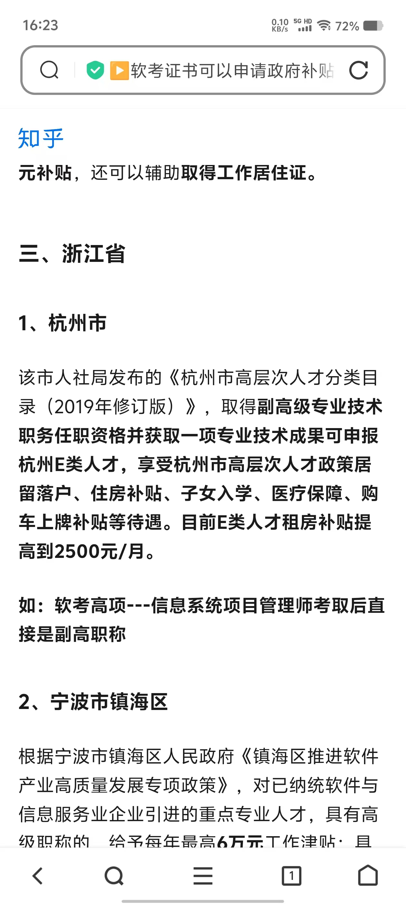

# 部署相关
## nginx 路径
```text
/usr/local/nginx/threejs
```
## github 登录接入
[登录接口文档](https://docs.github.com/zh/apps/oauth-apps/building-oauth-apps/authorizing-oauth-apps#web-application-flow)

[APP应用开发者相关信息](https://github.com/settings/applications/2674578)

## 软考证书相关
[软考证书查询](http://www.ruankao.org.cn/)

